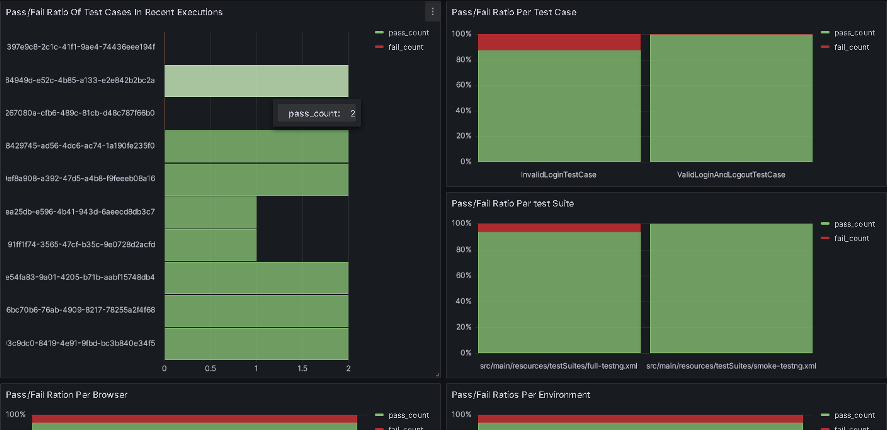

## Project Setup Guide

### About:

This is my portfolio project designed to showcase my approach to building a scalable and maintainable test automation framework using Java, Selenium Webdriver, TestNG, Maven and supporting dependencies. It uses [automationteststore.com](https://automationteststore.com/) as a sample web application.

### Key features:
- Uses the Page Object Model. Common functionalities are abstracted away in base classes which test cases and page objects inherit from.
- Test runs can be parametrised (desired browser, environment, test suite, etc..) using Maven properties.
- Optimized for parallel or multithreaded test executions.
- Handles advanced GUI interactions such as scrolling to elements and hovering over elements.
- Supports data-driven testing through .csv files and is equipped for multi-environment testing.
- Custom logging implementation, outputs into a database (see details bellow), supports visualisation and analytics.
- Automatically handles file separators based on the OS.

### Data-driven testing:

Test cases based on filling out forms, checking input validation, etc. are written in a data-agnostic manner, meaning a data-driven approach is possible using .csv files as long as the general required format of the test data is maintained.

<pre>
rowNr,firstName,firstNameValid,email,emailValid,enquiry,enquiryValid
1,Dan,true,dan.dan@dan.com,true,Lorem ipsu,true
2,D,false,dan.dan@dan.com,true,Lorem ipsu,true
3,Dan,true,dandandan.com,false,Lorem ipsu,true
4,Dan,true,dan.dan@dan.com,true,Lo,false
5,Dandandandandandandandandandandan,false,dan.dan@dan.com,true,Lorem ipsu,true
</pre>

### Prerequisites:

- JDK 17
- Maven
- A supported browser (Chrome, Edge, Firefox)

### To run locally:

1. Download drivers appropriate to your browser, browser version and OS
   - https://chromedriver.chromium.org/downloads
   - https://developer.microsoft.com/en-us/microsoft-edge/tools/webdriver/
   - https://github.com/mozilla/geckodriver/releases
2. Put the drivers into src/main/resources/drivers
3. Reload the Maven project to install dependencies
4. Set the browser you wish to test in (Chrome by default) by adjusting the browser property in pom.xml
5. Run the test suite by running src/main/resources/testSuites/full-testng.xml

### Running through Jenkins:

clean test -Dbrowser=edge -Denvironment=DEV -DsuiteXmlFile=src/main/resources/testSuites/full-testng.xml -Dheadless=false -DdbHost=placeholder -DdbUser=placeholder -DdbPassword=placeholder -DlogIntoDB=true

### Database logging:
Logging is handles trough the DBLogger class. A direct connection to a DB can be established. While running locally, database logging can be disabled by adjusting the logIntoDB property in pom.xml. While running in Jenkins, the dbHost, dbUser and dbPassword properties should not be stored in the pom.xml (keep the default placeholder values), but rather read values should be passed in Maven Goals in a buildstep.
- Initially I used ExtentReports as a simple, ready-made solution.
- Unsatisfied, I created by own logging tool (see repo [MiniLogger](https://github.com/slechtd/minilogger)) that produced JSON logs that can be consumed a visualised by a browser app, for example.
- Finally, I decided to log directly into a DB (see the DBLogger and DatabaseConnector classes) to enable advanced visualisation and analytics (such as Grafana).
- Realistically speaking, a production-ready implementation of my framework could probably use both approaches - a simple logging (such as using ExtentReports) for an immediate feedback during test development, and DB logging for further test result gathering, visualisation and analysis.

### Targed DB schema for DBLogger output:

The output data can then be easily visualised and analysed in Grafana, PowerBI...

<pre>
CREATE TABLE executions (
    execution_id VARCHAR(255) PRIMARY KEY,
    test_suite VARCHAR(255),
    browser VARCHAR(50),
    environment VARCHAR(50),
    headless BOOLEAN,
    executionStartTimestamp DATETIME,
    executionEndTimestamp DATETIME
);

CREATE TABLE screenshot_paths (
    id SERIAL PRIMARY KEY,
    execution_id VARCHAR(255),
    test_case_name VARCHAR(255),
    path VARCHAR(255),
    FOREIGN KEY (execution_id) REFERENCES executions(execution_id)
);

CREATE TABLE test_logs (
    id SERIAL PRIMARY KEY,
    execution_id VARCHAR(255),
    test_case_name VARCHAR(255),
    message TEXT,
    log_type VARCHAR(50),
    timestamp DATETIME,
    FOREIGN KEY (execution_id) REFERENCES executions(execution_id)
);
</pre>

### Example Grafana dashboard using the output data:

